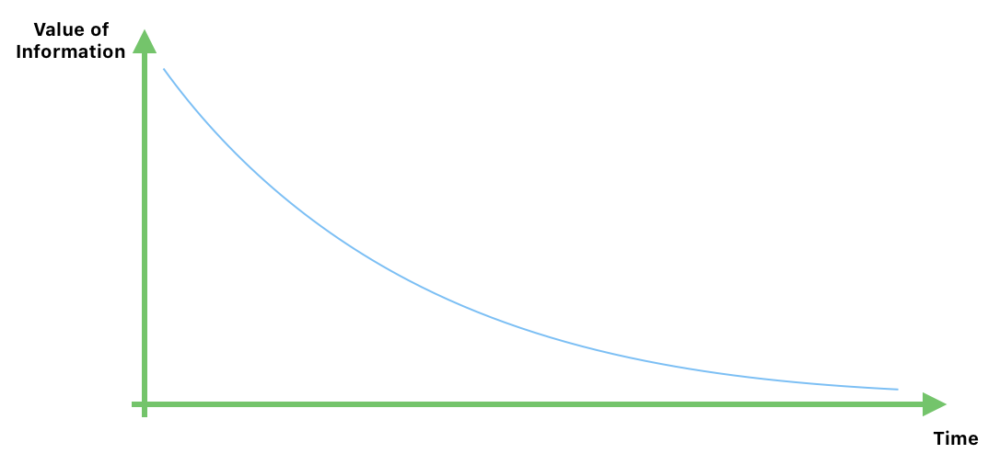

# Data and information

## Data

Data can take several Forms. It can be characters, symbols, images, audio clips,
video clips and so on. Non of which, on their own have any meaning.  
Example:

- 61300
- 61000

## Information

Information is data that has been given meaning. Which often results from the processing of data, sometimes by a computer.

Example:

- 61300 - Postal code of Puttalam
- 61000 - Postal code of Chilaw

Note: Information helps us to make decisions while data is just raw facts.

## Data Processing

Examples:

1. Just some numbers to postal codes
   

## Formates of Data

Text data

- Articles
- Poetry

Signs

- Road signs
- Symbols (Emojis)

Audio data

- Music
- Speech

Visual data

- Images
- Video clips
- Graphs

## Categarization of Data

We can categorize data into two main types.

### Quantitative Data

Quantitative data is numerical and acquired through counting or measuring. Quantitative data can be arranged and ordered.

Eg:- 3rd term ICT marks of G12 Students (We can order them from highest to lowest)

### Qualitative Data

Qualitative data is not measurable. But can be identified with their properties.

Eg:- Goodwill of a company (We can't measure it but we can identify it)

Ordering the goodwill from top to bottom by mobile manufacturers.

1. Apple
2. One Plus
3. samsung
4. Redmi
5. Others

## Some Expected Qualities from Information

- Relavance  
  Example:

  - Explaining a latest AI feature of mobile phone to grand parent is not relavant and they won't understand it.

- Timeliness  
  Example:
  - Informing a friend who is interested in participating a competition after the competition ended is not timely.
- Accuracy  
  Example:

  - Planning a movie night with friends and saying the time is in the evening rather than the exact time 7.00 pm is not accurate.

- Completeness  
  Example:

  - Explaining a recipe without mentioning the main ingredient is not complete.

- Understandability  
  Example:
  - Explaining a complex topic in a simple way is important for the audience to understand.
